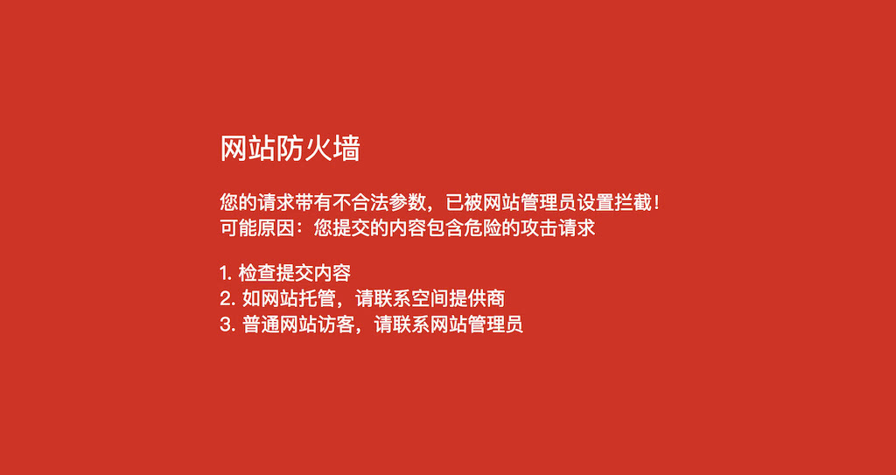

# Ngx_lua_waf

[中文说明](https://zhih.me/ngx-lua-waf/)

A web application firewall based on lua-nginx-module.

- Prevent SQL injection, local inclusion, partial overflow, fuzzing, xss, SSRF and other web attacks
- Prevent file leaks, such as svn / backup
- Prevent attacks from stress testing tools such as ApacheBench
- Block common scanning hacking tools, scanners
- Block unusual network requests
- Block image attachment class directory php execute permission
- Prevent webshell uploads



## How to install

### One key install

This script will install nginx-1.15.6, you can refer to the code, or look at my blog post https://zhih.me/make-your-website-support-tls1-3

```shell
sh -c "$(curl -kfsSl https://raw.githubusercontent.com/xzhih/nginx-compile/master/install.sh)"
```

### Normal install

**get ngx_lua_waf dependent module**

```shell
cd /usr/src/
wget https://github.com/openresty/luajit2/archive/v2.1-20181029.tar.gz
tar xzvf v2.1-20181029.tar.gz
mv luajit2-2.1-20181029 luajit-2.1

wget https://github.com/openresty/lua-cjson/archive/2.1.0.6.tar.gz
tar xzvf 2.1.0.6.tar.gz
mv lua-cjson-2.1.0.6 lua-cjson

wget https://github.com/simplresty/ngx_devel_kit/archive/v0.3.1rc1.tar.gz
tar xzvf v0.3.1rc1.tar.gz
mv ngx_devel_kit-0.3.1rc1 ngx_devel_kit

wget https://github.com/openresty/lua-nginx-module/archive/v0.10.13.tar.gz
tar xzvf v0.10.13.tar.gz  
mv lua-nginx-module-0.10.13 lua-nginx-module
```

**compile luajit**

```shell
cd luajit-2.1
make -j2 && make install
echo '/usr/local/lib' >> /etc/ld.so.conf.d/local.conf
ldconfig
```

**compile lua-cjson**

```shell
cd /usr/src/lua-cjson
export LUA_INCLUDE_DIR=/usr/local/include/luajit-2.1 
make -j2 && make install
```

**set LUAJIT env**

```shell
export LUAJIT_LIB=/usr/local/lib
export LUAJIT_INC=/usr/local/include/luajit-2.1
```

**compile nginx with these modules**

```shell
--add-module=../lua-nginx-module
--add-module=../ngx_devel_kit
```

**then get ngx_lua_waf**

```shell
cd /usr/local/nginx/conf/
git clone https://github.com/xzhih/ngx_lua_waf.git waf 

cat > /usr/local/nginx/conf/waf.conf << EOF
lua_shared_dict limit 20m;
lua_package_path "/usr/local/nginx/conf/waf/?.lua";
init_by_lua_file "/usr/local/nginx/conf/waf/init.lua";
access_by_lua_file "/usr/local/nginx/conf/waf/access.lua";
EOF

mkdir -p /usr/local/nginx/logs/waf 
chown www-data:www-data /usr/local/nginx/logs/waf 
```

the waf log you can find in `/usr/local/nginx/logs/waf`

**finally include `waf.conf` in `nginx.conf`**

```shell
include waf.conf;
```

Now you can reload nginx and visit http://youip/?a=a.sql 

you will see the firewall

## Copyright

https://github.com/lj2007331/ngx_lua_waf

https://github.com/loveshell/ngx_lua_waf

https://github.com/unixhot/waf
